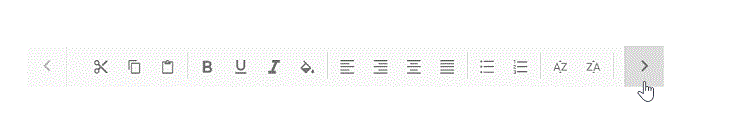
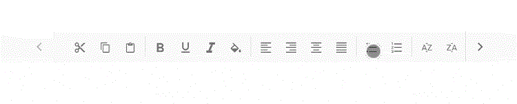
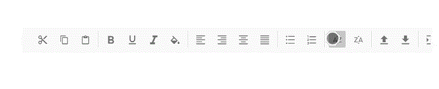
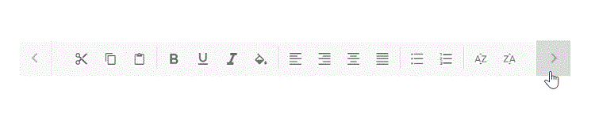
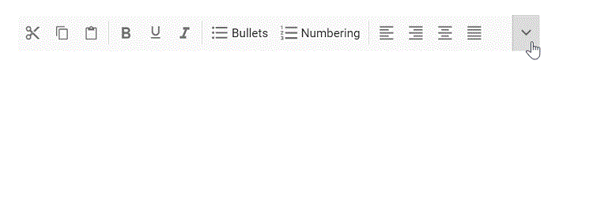

# Responsive Mode in React Toolbar

This section explains the supported display modes of the Toolbar when the content exceeds the viewing area. Possible modes are:

* Scrollable
* Popup

## Scrollable

The default overflow mode of the Toolbar is `Scrollable`. Scrollable display mode supports display of commands in a single line with horizontal scrolling enabled when commands overflow to available space.

* The right and left navigation arrows are added to the start and end of the Toolbar to navigate to hidden commands.
* You can also see the hidden commands using touch swipe action.
* By default, if the left navigation icon is disabled, swipe right to reveal hidden commands.
* Hidden commands become visible by clicking the arrow or by holding the arrow continuously.
* If device navigation icons are not available, you can swipe to see the hidden commands of the Toolbar.

* Once the Toolbar reaches the last or first command, the corresponding navigation icon will be disabled and you can move in the opposite direction.

* You can continuously scroll the Toolbar content by holding the navigation icon.












        


## Popup

`Popup` is another type of [`overflowMode`](https://ej2.syncfusion.com/react/documentation/api/toolbar#overflowmode) in which the Toolbar container holds the commands that can be placed in the available space. The rest of the overflowing commands that do not fit within the viewing area moves to the overflow popup container.

The commands placed in the popup can be viewed by opening the popup using the drop down icon given at the end of the Toolbar.

> If the popup content overflows the height of the page, then the rest of the commands will be hidden.

### Priority of commands

The default popup priority is set as `none`. When the commands of the Toolbar overflow, the ones that are listed last will be moved into the popup.

Users can customize the priority of commands to be displayed in the Toolbar and popup by using the [`overflow`](https://ej2.syncfusion.com/react/documentation/api/toolbar/itemModel#overflow) property.
Possible options:

Property | Description
------------ | -------------
  show       | Always shows the item in the `Toolbar` with primary priority.
  hide       | Always shows the item in the `Popup` with secondary priority.
  none       | No priority is considered; commands move to the popup in normal order when content exceeds the viewing area.

If primary priority commands also exceed the available space, they are moved to the popup container at the top order position and placed before the secondary priority commands.

> You can maintain toolbar item on popup always by using the [`showAlwaysInPopup`](https://ej2.syncfusion.com/react/documentation/api/toolbar/item#showalwaysinpopup) property, and this behavior is not applicable for toolbar items with [`overflow`](https://ej2.syncfusion.com/react/documentation/api/toolbar/item#overflow) property as 'show'.












        


### Text mode for buttons

The [`showTextOn`](https://ej2.syncfusion.com/react/documentation/api/toolbar/item#showtexton) property is used to decide the button text display area in the Toolbar, popup or in both places. This is useful to do customization in which the user needs to show the text and image representation of commands.

For example, the user can show icon only button in the Toolbar and where in a popup container user can show more information about the commands with icon and text.

Possible values are,

Property | Description
------------ | -------------
  Both     | Button Text is visible in both `Toolbar` and `Popup`.
  Overflow | Button Text is only visible in `Popup`.
  Toolbar  | Button Text is only visible in the `Toolbar`.

In the sample below, the text is visible only in the popup container, not in the Toolbar.












        

