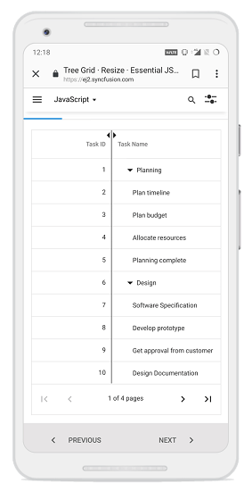

# Column resizing in React TreeGrid 

Column width can be adjusted by clicking and dragging the right edge of a column header. While dragging, the column resizes immediately. Double-clicking the right edge of a column header automatically fits that column to the widest cell content. To enable column resizing, set the [`allowResizing`](https://ej2.syncfusion.com/react/documentation/api/treegrid/#allowresizing) property to true.

To use column resizing, inject the **Resize** module in the TreeGrid.










 

> Resizing can be disabled for a specific column by setting [columns.allowResizing](https://ej2.syncfusion.com/react/documentation/api/treegrid/columnModel/#allowresizing) to false.  
> In RTL mode, drag the left edge of the header cell to resize the column.

## Min and max width

Resizing can be constrained using [columns.minWidth](https://ej2.syncfusion.com/react/documentation/api/treegrid/column/#minwidth) and [columns.maxWidth](https://ej2.syncfusion.com/react/documentation/api/treegrid/column/#maxwidth).

In the following sample, minimum and maximum widths are defined for the **Duration** and **Task Name** columns.










 

## Resize stacked column

Stacked columns can be resized by dragging the right edge of the stacked header. While dragging, all child columns under the stacked header resize proportionally. To disable resizing for a particular stacked column, set [allowResizing](https://ej2.syncfusion.com/react/documentation/api/treegrid/column/#allowresizing) to **false** on the respective child columns.










 

## Touch interaction

When the right edge of a header cell is tapped, a floating handler appears over the column border. Drag the floating handler to adjust the column width.

The following screenshot illustrates column resizing on a touch device.

<!-- markdownlint-disable MD033 -->

<!-- markdownlint-enable MD033 -->