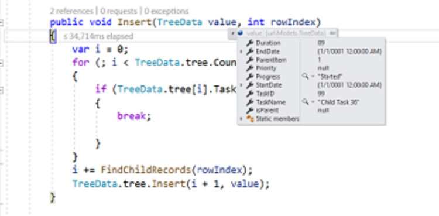
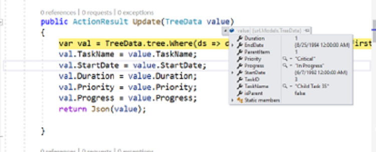
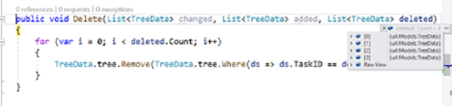
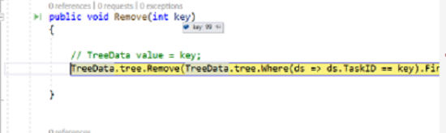

# Persisting data in server in React TreeGrid

Edited data can be persisted to a database using RESTful web services.

All CRUD operations in the TreeGrid are performed through the [DataManager](../../data). The `DataManager` can bind CRUD requests to server-side endpoints.

> The ODataAdaptor persists data on the server according to the OData protocol.

The following sections explain how to perform server-side CRUD using the [UrlAdaptor](../../../data/adaptors.html#url-adaptor) and the `RemoteSaveAdaptor`.

## URL adaptor

Use the [UrlAdaptor](../../../data/adaptors.html#url-adaptor) when binding a data source from a remote service. On initial load, data is fetched from the remote endpoint specified in the `url` property of `DataManager` and bound to the TreeGrid. Map CRUD operations to server-side controller actions using `insertUrl`, `removeUrl`, `updateUrl`, and `batchUrl`.

The following example demonstrates this behavior.

```ts

import { DataManager, UrlAdaptor } from '@syncfusion/ej2-data';
import { ColumnDirective, ColumnsDirective, TreeGridComponent } from '@syncfusion/ej2-react-treegrid';
import { Edit, EditSettingsModel, Inject, Toolbar, ToolbarItems } from '@syncfusion/ej2-react-treegrid';
import * as React from 'react';


function App() {

    const editOptions: EditSettingsModel = { allowEditing: true, allowAdding: true, allowDeleting: true, mode: 'Row', newRowPosition: 'Below' };

    const toolbarOptions: ToolbarItems[] = ['Add', 'Edit', 'Delete', 'Update', 'Cancel'];

    const dataManager: DataManager = new DataManager({
        adaptor: new UrlAdaptor,
        insertUrl: "Home/Insert",
        removeUrl: "Home/Delete",
        updateUrl: "Home/Update",
        batchUrl: "Home/Remove",
        url: "Home/DataSource",
    });

    return <TreeGridComponent dataSource={dataManager} treeColumnIndex={1} idMapping= 'TaskID'
    parentIdMapping='parentID' height='270' editSettings={editOptions}
    toolbar={toolbarOptions}>
        <ColumnsDirective>
          <ColumnDirective field='TaskID' headerText='Task ID' width='90' textAlign='Right' isPrimaryKey={true}/>
          <ColumnDirective field='TaskName' headerText='Task Name' width='180'/>
          <ColumnDirective field='StartDate' headerText='Start Date' width='90' textAlign='Right' editType='datepickeredit' format='yMd' type='date' />
          <ColumnDirective field='EndDate' headerText='End Date' width='90' format='yMd' textAlign='Right' />
          <ColumnDirective field='Priority' headerText='Priority' width='110' editType='dropdownedit'/>
        </ColumnsDirective>
        <Inject services={[Edit,Toolbar]}/>
        </TreeGridComponent>
};
export default App;

```

When using the `UrlAdaptor`, return JSON from controller actions. the JSON object must contain a property as `result` with dataSource as its value and one more property `count` with the dataSource total records count as its value.

The following example illustrates the expected response pattern.

```ts

public ActionResult DataSource(DataManager dm)
{
    var DataSource = TreeData.GetTree();
    DataOperations operation = new DataOperations();
    if (dm.Where != null && dm.Where.Count > 0)
    {
        DataSource = operation.PerformFiltering(DataSource, dm.Where, "and");   //perform filtering  and maintain child records on Expand/Collapse operation
    }
    var count = DataSource.ToList<TreeData>().Count();
    if (dm.Skip != 0)
    {
        DataSource = operation.PerformSkip(DataSource, dm.Skip);   //Paging
    }
    if (dm.Take != 0)
    {
        DataSource = operation.PerformTake(DataSource, dm.Take);
    }
    return dm.RequiresCounts ? Json(new { result = DataSource, count = count }) : Json(DataSource);
}

```

## Insert record

Specify the controller action URL for insert operations on the server-side using `insertUrl`.

The following example inserts a new record based on `newRowPosition` set to "Below".

```ts

public void Insert(TreeGridData value, int relationalKey)
{
    var i = 0;
    for (; i < TreeData.tree.Count; i++)
    {
        if (TreeData.tree[i].TaskID == relationalKey)
        {
            break;
        }
    }
    i += FindChildRecords(relationalKey); // Inserted new record when newRowPosition API is in "Below".
    TreeData.tree.Insert(i + 1, value);
}

public int FindChildRecords(int id)
{
    var count = 0;
    for (var i = 0; i < TreeData.tree.Count; i++)
    {
        if (TreeData.tree[i].ParentItem == id)
        {
            count++;
            count += FindChildRecords(TreeData.tree[i].TaskID);
        }
    }
    return count;
}

```

The newly added record is provided in the `value` parameter. The `relationalKey` parameter contains the primary key of the selected record and is used to determine the insert position.



## Update record

Specify the controller action URL for save/update operations on the server-side using `updateUrl`.

The following example updates an existing record.

```ts

public ActionResult Update(TreeGridData value)
{
    var val = TreeData.tree.Where(ds => ds.TaskID == value.TaskID).FirstOrDefault();
    val.TaskName = value.TaskName;
    val.StartDate = value.StartDate;
    val.Duration = value.Duration;
    val.Priority = value.Priority;
    val.Progress = value.Progress;
    return Json(value);
}

```

The updated record is provided in the `value` parameter.



## Delete record

Specify controller action URLs for delete operations  on the server-side using `removeUrl` and `batchUrl`.

The following example demonstrates single and batch delete operations.

```ts

public ActionResult Delete(int key)
{
    TreeData.tree.Remove(TreeData.tree.Where(ds => ds.TaskID == key).FirstOrDefault());
}

// Remove method (batchUrl) will be triggered when we delete parent record.

public ActionResult Remove(List<TreeGridData> changed, List<TreeGridData> added, List<TreeGridData> deleted)
{
    for (var i = 0; i < deleted.Count; i++)
    {
        TreeData.tree.Remove(TreeData.tree.Where(ds => ds.TaskID == deleted[i].TaskID).FirstOrDefault());
    }
}

```

For single delete, the primary key is provided in the `key` parameter.



When deleting a parent record, both parent and child records are provided in the `deleted` parameter.



## Remote save adaptor

When all TreeGrid actions should run on the client except CRUD (which must be persisted on the server), use `RemoteSaveAdaptor`.

* Set the initial data to the `json` property
* Set `adaptor` to `RemoteSaveAdaptor`
* Map CRUD operations using `updateUrl`, `insertUrl`, `removeUrl`, and `batchUrl`

The following example shows `RemoteSaveAdaptor` configuration.

```ts

import { DataManager, RemoteSaveAdaptor } from '@syncfusion/ej2-data';
import { ColumnDirective, ColumnsDirective, TreeGridComponent } from '@syncfusion/ej2-react-treegrid';
import { Edit, EditSettingsModel, Inject, Toolbar, ToolbarItems } from '@syncfusion/ej2-react-treegrid';
import * as React from 'react';

import { projectData } from './datasource';

function App() {

    const editOptions: EditSettingsModel = { allowEditing: true, allowAdding: true, allowDeleting: true, mode: 'Row', newRowPosition: 'Below' };

    const toolbarOptions: ToolbarItems[] = ['Add', 'Edit', 'Delete', 'Update', 'Cancel'];

    const dataManager: DataManager = new DataManager({
        adaptor: new RemoteSaveAdaptor,
        insertUrl: "Home/Insert",
        removeUrl: "Home/Delete",
        updateUrl: "Home/Update",
        batchUrl: "Home/Remove",
        json: projectData,
    });

    return <TreeGridComponent dataSource={dataManager} treeColumnIndex={1} idMapping= 'TaskID'
    parentIdMapping='parentID' height='270' editSettings={editOptions}
    toolbar={toolbarOptions}>
        <ColumnsDirective>
          <ColumnDirective field='TaskID' headerText='Task ID' width='90' textAlign='Right' isPrimaryKey={true}/>
          <ColumnDirective field='TaskName' headerText='Task Name' width='180'/>
          <ColumnDirective field='StartDate' headerText='Start Date' width='90' textAlign='Right' editType='datepickeredit' format='yMd' type='date' />
          <ColumnDirective field='EndDate' headerText='End Date' width='90' format='yMd' textAlign='Right' />
          <ColumnDirective field='Priority' headerText='Priority' width='110' editType='dropdownedit'/>
        </ColumnsDirective>
        <Inject services={[Edit,Toolbar]}/>
    </TreeGridComponent>
};
export default App;

```

The following example illustrates server-side handlers for CRUD with `RemoteSaveAdaptor`.

```ts

public void Insert(TreeData value, int relationalKey)
{
    var i = 0;
    for (; i < TreeData.tree.Count; i++)
    {
        if (TreeData.tree[i].TaskID == relationalKey)
        {
            break;
        }
    }
    i += FindChildRecords(relationalKey); // Inserted new record when newRowPosition API is in "Below".
    TreeData.tree.Insert(i + 1, value);
}

public ActionResult Update(TreeData value)
{
    var val = TreeData.tree.Where(ds => ds.TaskID == value.TaskID).FirstOrDefault();
    val.TaskName = value.TaskName;
    val.StartDate = value.StartDate;
    val.Duration = value.Duration;
    val.Priority = value.Priority;
    val.Progress = value.Progress;
    return Json(value);
}

public ActionResult Delete(int key)
{
    TreeData.tree.Remove(TreeData.tree.Where(ds => ds.TaskID == key).FirstOrDefault());;
}

// Remove method (batchUrl) will be triggered when we delete parent record.

public ActionResult Remove(List<TreeGridData> changed, List<TreeGridData> added, List<TreeGridData> deleted)
{
    for (var i = 0; i < deleted.Count; i++)
    {
        TreeData.tree.Remove(TreeData.tree.Where(ds => ds.TaskID == deleted[i].TaskID).FirstOrDefault());
    }
}

```