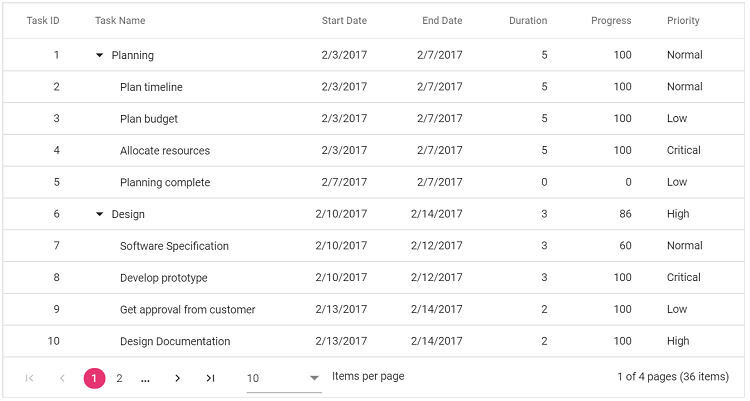

# Paging in React TreeGrid

Paging displays TreeGrid data in page segments. Enable paging by setting [allowPaging](https://ej2.syncfusion.com/react/documentation/api/treegrid/#allowpaging) to **true**. When enabled, the pager is rendered at the bottom of the TreeGrid. Paging behavior is configured through [pageSettings](https://ej2.syncfusion.com/react/documentation/api/treegrid/#pagesettings).

To use paging, inject the **Page** module in the TreeGrid.










 

> Paging improves performance by fetching only a defined number of records per request.

## Page Size Mode

Two behaviors are available for determining records per page via [pageSizeMode](https://ej2.syncfusion.com/react/documentation/api/treegrid/pageSettingsModel/#pagesizemode):

- **All** (default): Records per page are determined by [pageSize](https://ej2.syncfusion.com/react/documentation/api/treegrid/pageSettingsModel/#pagesize) property.
- **Root**: The number of root (level 0) records per page is determined by [pageSize](https://ej2.syncfusion.com/react/documentation/api/treegrid/pageSettingsModel/#pagesize) property.

With [pageSizeMode](https://ej2.syncfusion.com/react/documentation/api/treegrid/pageSettingsModel/#pagesizemode) property as **Root** only the root level or the 0th level records are considered in records count.










 

## Template

Custom elements can be rendered inside the pager using the [template](https://ej2.syncfusion.com/react/documentation/api/treegrid/pageSettingsModel/#template) property. Within the template, the following values are available: [currentPage](https://ej2.syncfusion.com/react/documentation/api/treegrid/pageSettingsModel/#currentpage), [pageSize](https://ej2.syncfusion.com/react/documentation/api/treegrid/pageSettingsModel/#pagesize), [pageCount](https://ej2.syncfusion.com/react/documentation/api/treegrid/pageSettingsModel/#pagecount), `totalPage`, and `totalRecordCount`.










 

## Pager with Page Size Dropdown

A pager dropdown allows changing the number of records per page dynamically. Enable it by setting [pageSettings.pageSizes](https://ej2.syncfusion.com/react/documentation/api/treegrid/pageSettingsModel/#pagesizes) to **true**.

```ts
    const pageSettings: PageSettingsModel = { pageSize: 7, pageSizes: true };
```



## Render pager at the top of the TreeGrid

By default, the pager is rendered at the bottom. Render the pager at the top using the [dataBound](https://ej2.syncfusion.com/react/documentation/api/treegrid/#databound) event.










 

> During paging, the pager triggers these events:
> * [created](https://ej2.syncfusion.com/react/documentation/api/pager/#created): Triggered when the pager is created.
> * [click](https://ej2.syncfusion.com/react/documentation/api/pager/#click): Triggered when numeric items are clicked.
> * [dropDownChanged](https://ej2.syncfusion.com/react/documentation/api/pager/#dropdownchanged): Triggered when the pageSize dropdown value changes.
> Refer to the [React TreeGrid](https://www.syncfusion.com/react-ui-components/react-tree-grid) feature tour for key capabilities. Explore the [React TreeGrid example](https://ej2.syncfusion.com/react/demos/#/material/treegrid/treegrid-overview) to learn how to present and manipulate data.