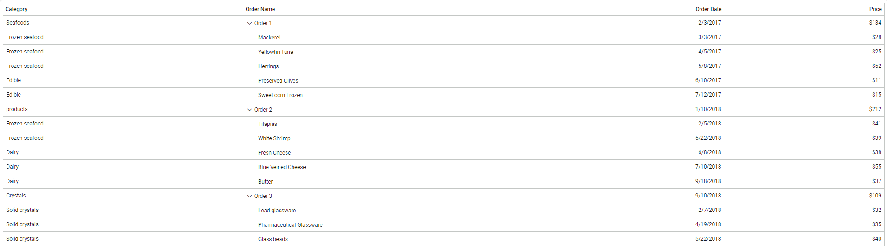

# Getting Started with the TreeGrid Component in the Preact Framework

This article provides a step-by-step guide for setting up a [Preact](https://preactjs.com/) project and integrating the Syncfusion<sup style="font-size:70%">&reg;</sup> React TreeGrid component.

`Preact` is a fast and lightweight JavaScript library for building user interfaces. It's often used as an alternative to larger frameworks like React. The key difference is that Preact is designed to be smaller in size and faster in performance, making it a good choice for projects where file size and load times are critical factors. 

## Prerequisites

[System requirements for Syncfusion<sup style="font-size:70%">&reg;</sup> React UI components](../system-requirement)

## Set up the Preact project

To create a new `Preact` project, use one of the commands that are specific to either NPM or Yarn.

```bash
npm init preact
```

or

```bash
yarn init preact
```

Using one of the above commands will lead you to set up additional configurations for the project, as below:

1\. Define the project name: We can specify the name of the project directly. Let's specify the name of the project as `my-project` for this article.

```bash
T  Preact - Fast 3kB alternative to React with the same modern API
|
*  Project directory:
|  my-project
—      
```

2\. Choose `JavaScript` as the framework variant to build this Preact project using JavaScript and React.

```bash
T  Preact - Fast 3kB alternative to React with the same modern API
|
*  Project language:
|  > JavaScript
|    TypeScript
—
```

3\. Then configure the project as below for this article.

```bash
T  Preact - Fast 3kB alternative to React with the same modern API
|
*  Use router?
|    Yes / > No
—
|
*  Prerender app (SSG)?
|    Yes / > No
—
|
*  Use ESLint?
|    Yes / > No
—
```

5\. Upon completing the aforementioned steps to create `my-project`, run the following command to jump into the project directory:

```bash
cd my-project
```

Now that `my-project` is ready to run with default settings, let's add Syncfusion<sup style="font-size:70%">&reg;</sup> components to the project.

## Add the Syncfusion<sup style="font-size:70%">&reg;</sup> React packages

Syncfusion<sup style="font-size:70%">&reg;</sup> React component packages are available at [npmjs.com](https://www.npmjs.com/search?q=ej2-react). To use Syncfusion<sup style="font-size:70%">&reg;</sup> React components in the project, install the corresponding npm package.

This article uses the [React TreeGrid component](https://www.syncfusion.com/react-components/react-tree-grid) as an example. To use the React TreeGrid component in the project, the `@syncfusion/ej2-react-treegrid` package needs to be installed using the following command:

```bash
npm install @syncfusion/ej2-react-treegrid --save
```

or

```bash
yarn add @syncfusion/ej2-react-treegrid
```

## Import Syncfusion<sup style="font-size:70%">&reg;</sup> CSS styles

You can import themes for the Syncfusion<sup style="font-size:70%">&reg;</sup> React component in various ways, such as using CSS or SASS styles from npm packages, CDN, CRG and [Theme Studio](https://ej2.syncfusion.com/react/documentation/appearance/theme-studio/). Refer to [themes topic](https://ej2.syncfusion.com/react/documentation/appearance/theme/) to know more about built-in themes and different ways to refer to theme's in a React project.

In this article, the `Material 3` theme is applied using CSS styles, which are available in installed packages. The necessary `Material 3` CSS styles for the TreeGrid component and its dependents were imported into the **src/style.css** file.




@import '../node_modules/@syncfusion/ej2-base/styles/material3.css';  
@import '../node_modules/@syncfusion/ej2-buttons/styles/material3.css';  
@import '../node_modules/@syncfusion/ej2-calendars/styles/material3.css';  
@import '../node_modules/@syncfusion/ej2-dropdowns/styles/material3.css';  
@import '../node_modules/@syncfusion/ej2-inputs/styles/material3.css';  
@import '../node_modules/@syncfusion/ej2-navigations/styles/material3.css';
@import '../node_modules/@syncfusion/ej2-popups/styles/material3.css';
@import '../node_modules/@syncfusion/ej2-splitbuttons/styles/material3.css';
@import "../node_modules/@syncfusion/ej2-grids/styles/material3.css";
@import "../node_modules/@syncfusion/ej2-react-treegrid/styles/material3.css";




> The order of importing CSS styles should be in line with its dependency graph.
## Add the Syncfusion<sup style="font-size:70%">&reg;</sup> React component

Follow the below steps to add the React TreeGrid component to the Vite project:

1\. Before adding the TreeGrid component to your markup, import the TreeGrid component in the **src/index.jsx** file.




import { ColumnDirective, ColumnsDirective, TreeGridComponent } from '@syncfusion/ej2-react-treegrid';




2\. Then, define the TreeGrid component with the [dataSource](https://helpej2.syncfusion.com/react/documentation/api/treegrid#datasource) property and column definitions. Declare the values for the `dataSource` property.




import { render } from 'preact';
import { ColumnDirective, ColumnsDirective, TreeGridComponent } from '@syncfusion/ej2-react-treegrid';
import './style.css';

function App() {
	let sortData = [
		{
			orderID: '1',
			orderName: 'Order 1',
			orderDate: new Date('02/03/2017'),
			shippedDate: new Date('02/09/2017'),
			units: '1395',
			unitPrice: '47.42',
			price: 134,
			Category: 'Seafoods',
			subtasks: [
				{ orderID: '1.1', orderName: 'Mackerel', Category: 'Frozen seafood', units: '235',
					orderDate: new Date('03/03/2017'), shippedDate: new Date('03/10/2017'), unitPrice: '12.35', price: 28 },
				{ orderID: '1.2', orderName: 'Yellowfin Tuna', Category: 'Frozen seafood', units: '324',
					orderDate: new Date('04/05/2017'), shippedDate: new Date('04/12/2017'), unitPrice: '18.56', price: 25 },
				{ orderID: '1.3', orderName: 'Herrings', Category: 'Frozen seafood', units: '488',
					orderDate: new Date('05/08/2017'), shippedDate: new Date('05/15/2017'), unitPrice: '11.45', price: 52 },
				{ orderID: '1.4', orderName: 'Preserved Olives', Category: 'Edible', units: '125',
					orderDate: new Date('06/10/2017'), shippedDate: new Date('06/17/2017'), unitPrice: '19.26', price: 11 },
				{ orderID: '1.5', orderName: 'Sweet corn Frozen', Category: 'Edible', units: '223',
					orderDate: new Date('07/12/2017'), shippedDate: new Date('07/19/2019'), unitPrice: '17.54', price: 15 }
			]
		},
		{
			orderID: '2',
			orderName: 'Order 2',
			orderDate: new Date('01/10/2018'),
			shippedDate: new Date('01/16/2018'),
			units: '1944',
			unitPrice: '58.45',
			price: 212,
			Category: 'products',
			subtasks: [
				{ orderID: '2.1', orderName: 'Tilapias', Category: 'Frozen seafood',
					orderDate: new Date('02/05/2018'), shippedDate: new Date('02/12/2018'), units: '278', unitPrice: '15.26', price: 41 },
				{ orderID: '2.2', orderName: 'White Shrimp', Category: 'Frozen seafood', units: '560',
					orderDate: new Date('05/22/2018'), shippedDate: new Date('05/29/2018'), unitPrice: '17.26', price: 39 },
				{ orderID: '2.3', orderName: 'Fresh Cheese', Category: 'Dairy', units: '323', unitPrice: '12.67',
					orderDate: new Date('06/08/2018'), shippedDate: new Date('06/15/2018'), price: 38 },
				{ orderID: '2.4', orderName: 'Blue Veined Cheese', Category: 'Dairy', units: '370', unitPrice: '15.25',
					orderDate: new Date('07/10/2018'), shippedDate: new Date('07/17/2018'), price: 55 },
				{ orderID: '2.5', orderName: 'Butter', Category: 'Dairy', units: '413', unitPrice: '19.25',
					orderDate: new Date('09/18/2018'), shippedDate: new Date('09/25/2018'), price: 37.17 }
			]
		},
		{
			orderID: '3',
			orderName: 'Order 3',
			orderDate: new Date('09/10/2018'),
			shippedDate: new Date('09/20/2018'),
			units: '1120',
			unitPrice: '33.45',
			price: 109,
			Category: 'Crystals',
			subtasks: [
				{ orderID: '3.1', orderName: 'Lead glassware', Category: 'Solid crystals',
					orderDate: new Date('02/07/2018'), shippedDate: new Date('02/14/2018'), units: '542', unitPrice: '16.45', price: 32 },
				{ orderID: '3.2', orderName: 'Pharmaceutical Glassware', Category: 'Solid crystals',
					orderDate: new Date('04/19/2018'), shippedDate: new Date('04/26/2018'), units: '324', unitPrice: '11.45', price: 35 },
				{ orderID: '3.3', orderName: 'Glass beads', Category: 'Solid crystals', units: '254',
					orderDate: new Date('05/22/2018'), shippedDate: new Date('03/22/2018'), unitPrice: '16.23', price: 40 }
			]
		}
	];
    return <TreeGridComponent dataSource={sortData} treeColumnIndex={1} childMapping= 'subtasks'>
        <ColumnsDirective>
            <ColumnDirective field='Category' headerText='Category' width='150'/>
            <ColumnDirective field='orderName' headerText='Order Name' width='170'/>
            <ColumnDirective field='orderDate' headerText='Order Date' width='130' format='yMd' textAlign='Right' type='date' />
            <ColumnDirective field='price' headerText='Price' width='100' textAlign='Right' type='number' format='C0' />
        </ColumnsDirective>
    </TreeGridComponent>
};

render(<App />, document.querySelector('#app'))




## Run the project

To run the project, use the following command:

```bash
npm run dev
```

or

```bash
yarn run dev
```

The output will appear as follows:



## See also

[Getting Started with the Syncfusion<sup style="font-size:70%">&reg;</sup> React UI Component](../getting-started/quick-start)
