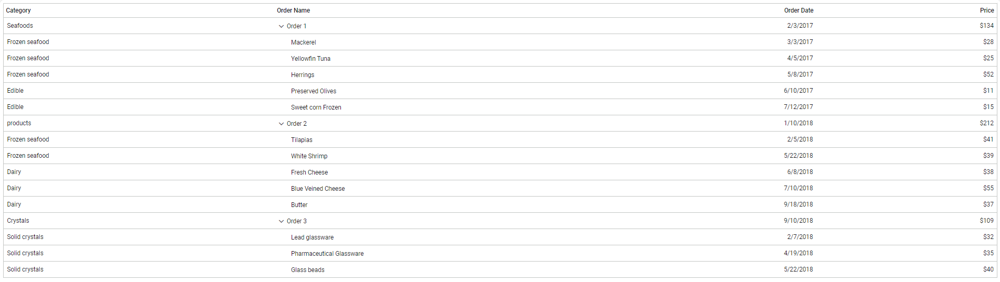

# Getting Started with the Tree Grid Component in the Preact Framework

This article provides a step-by-step guide for setting up a [Preact](https://preactjs.com/) project and integrating the Syncfusion<sup style="font-size:70%">&reg;</sup> React Tree Grid component.

`Preact` is a fast and lightweight JavaScript library for building user interfaces. It is often used as an alternative to larger frameworks like React. The key difference is that Preact is designed to be smaller in size and faster in performance, making it suitable for projects where file size and load times are critical factors. 

## Prerequisites

[System requirements for Syncfusion<sup style="font-size:70%">&reg;</sup> React UI components](../system-requirement)

## Set up the Preact project

To create a new `Preact` project, use one of the commands specific to NPM or Yarn.

```bash
npm init preact
```

or

```bash
yarn init preact
```

The command initializes an interactive setup to configure the project as shown below:

1\. Define the project name. Specify the name `my-project` for this article.

```bash
T  Preact - Fast 3kB alternative to React with the same modern API
|
*  Project directory:
|  my-project
—      
```

2\. Choose `JavaScript` as the framework variant to build this Preact project using JavaScript and React.

```bash
T  Preact - Fast 3kB alternative to React with the same modern API
|
*  Project language:
|  > JavaScript
|    TypeScript
—
```

3\. Configure the project as shown below for this article.

```bash
T  Preact - Fast 3kB alternative to React with the same modern API
|
*  Use router?
|    Yes / > No
—
|
*  Prerender app (SSG)?
|    Yes / > No
—
|
*  Use ESLint?
|    Yes / > No
—
```

4\. After completing the setup, run the following command to navigate to the project directory:

```bash
cd my-project
```

With `my-project` ready using default settings, add Syncfusion<sup style="font-size:70%">&reg;</sup> components to the project.

## Adding Syncfusion<sup style="font-size:70%">&reg;</sup> React Tree Grid packages

Syncfusion<sup style="font-size:70%">&reg;</sup> React component packages are available at [npmjs.com](https://www.npmjs.com/search?q=ej2-react). To use Syncfusion<sup style="font-size:70%">&reg;</sup> React components in the project, install the corresponding npm package.

This article uses the [React Tree Grid component](https://www.syncfusion.com/react-components/react-tree-grid) as an example. To use the React Tree Grid component in the project, install the `@syncfusion/ej2-react-treegrid` package using one of the following commands:

```bash
npm install @syncfusion/ej2-react-treegrid --save
```

or

```bash
yarn add @syncfusion/ej2-react-treegrid
```

> Before including Syncfusion styles, make sure to remove the default styles defined in **index.css**. This helps prevent unintended style overrides and ensures that Syncfusion components render correctly.

## Adding CSS reference

Themes for Syncfusion® React Tree Grid component can be applied using CSS files provided through npm theme packages, CDN, CRG, or Theme Studio. For more information, refer to the [Themes](https://ej2.syncfusion.com/react/documentation/appearance/theme) documentation.

Install the **Material 3** theme package using the following command:




npm install @syncfusion/ej2-material3-theme --save




Then add the following CSS reference to the **src/style.css** file:




@import "../node_modules/@syncfusion/ej2-material3-theme/styles/treegrid/index.css";




## Adding Tree Grid component

Follow these steps to add the React Tree Grid component to the Preact project:

1\. Before adding the Tree Grid component to the markup, import the Tree Grid component in the **src/index.jsx** file.




import { ColumnDirective, ColumnsDirective, TreeGridComponent } from '@syncfusion/ej2-react-treegrid';




2\. Define the Tree Grid component with the [dataSource](https://helpej2.syncfusion.com/react/documentation/api/treegrid#datasource) property and column definitions. Declare the values for the `dataSource` property.




import { render } from 'preact';
import { ColumnDirective, ColumnsDirective, TreeGridComponent } from '@syncfusion/ej2-react-treegrid';
import './style.css';

function App() {
	let sortData = [
		{
			orderID: '1',
			orderName: 'Order 1',
			orderDate: new Date('02/03/2017'),
			shippedDate: new Date('02/09/2017'),
			units: '1395',
			unitPrice: '47.42',
			price: 134,
			Category: 'Seafoods',
			subtasks: [
				{ orderID: '1.1', orderName: 'Mackerel', Category: 'Frozen seafood', units: '235',
					orderDate: new Date('03/03/2017'), shippedDate: new Date('03/10/2017'), unitPrice: '12.35', price: 28 },
				{ orderID: '1.2', orderName: 'Yellowfin Tuna', Category: 'Frozen seafood', units: '324',
					orderDate: new Date('04/05/2017'), shippedDate: new Date('04/12/2017'), unitPrice: '18.56', price: 25 },
				{ orderID: '1.3', orderName: 'Herrings', Category: 'Frozen seafood', units: '488',
					orderDate: new Date('05/08/2017'), shippedDate: new Date('05/15/2017'), unitPrice: '11.45', price: 52 },
				{ orderID: '1.4', orderName: 'Preserved Olives', Category: 'Edible', units: '125',
					orderDate: new Date('06/10/2017'), shippedDate: new Date('06/17/2017'), unitPrice: '19.26', price: 11 },
				{ orderID: '1.5', orderName: 'Sweet corn Frozen', Category: 'Edible', units: '223',
					orderDate: new Date('07/12/2017'), shippedDate: new Date('07/19/2019'), unitPrice: '17.54', price: 15 }
			]
		},
		{
			orderID: '2',
			orderName: 'Order 2',
			orderDate: new Date('01/10/2018'),
			shippedDate: new Date('01/16/2018'),
			units: '1944',
			unitPrice: '58.45',
			price: 212,
			Category: 'products',
			subtasks: [
				{ orderID: '2.1', orderName: 'Tilapias', Category: 'Frozen seafood',
					orderDate: new Date('02/05/2018'), shippedDate: new Date('02/12/2018'), units: '278', unitPrice: '15.26', price: 41 },
				{ orderID: '2.2', orderName: 'White Shrimp', Category: 'Frozen seafood', units: '560',
					orderDate: new Date('05/22/2018'), shippedDate: new Date('05/29/2018'), unitPrice: '17.26', price: 39 },
				{ orderID: '2.3', orderName: 'Fresh Cheese', Category: 'Dairy', units: '323', unitPrice: '12.67',
					orderDate: new Date('06/08/2018'), shippedDate: new Date('06/15/2018'), price: 38 },
				{ orderID: '2.4', orderName: 'Blue Veined Cheese', Category: 'Dairy', units: '370', unitPrice: '15.25',
					orderDate: new Date('07/10/2018'), shippedDate: new Date('07/17/2018'), price: 55 },
				{ orderID: '2.5', orderName: 'Butter', Category: 'Dairy', units: '413', unitPrice: '19.25',
					orderDate: new Date('09/18/2018'), shippedDate: new Date('09/25/2018'), price: 37.17 }
			]
		},
		{
			orderID: '3',
			orderName: 'Order 3',
			orderDate: new Date('09/10/2018'),
			shippedDate: new Date('09/20/2018'),
			units: '1120',
			unitPrice: '33.45',
			price: 109,
			Category: 'Crystals',
			subtasks: [
				{ orderID: '3.1', orderName: 'Lead glassware', Category: 'Solid crystals',
					orderDate: new Date('02/07/2018'), shippedDate: new Date('02/14/2018'), units: '542', unitPrice: '16.45', price: 32 },
				{ orderID: '3.2', orderName: 'Pharmaceutical Glassware', Category: 'Solid crystals',
					orderDate: new Date('04/19/2018'), shippedDate: new Date('04/26/2018'), units: '324', unitPrice: '11.45', price: 35 },
				{ orderID: '3.3', orderName: 'Glass beads', Category: 'Solid crystals', units: '254',
					orderDate: new Date('05/22/2018'), shippedDate: new Date('03/22/2018'), unitPrice: '16.23', price: 40 }
			]
		}
	];
    return <TreeGridComponent dataSource={sortData} treeColumnIndex={1} childMapping= 'subtasks'>
        <ColumnsDirective>
            <ColumnDirective field='Category' headerText='Category' width='150'/>
            <ColumnDirective field='orderName' headerText='Order Name' width='170'/>
            <ColumnDirective field='orderDate' headerText='Order Date' width='130' format='yMd' textAlign='Right' type='date' />
            <ColumnDirective field='price' headerText='Price' width='100' textAlign='Right' type='number' format='C0' />
        </ColumnsDirective>
    </TreeGridComponent>
};

render(<App />, document.querySelector('#app'))




## Run the project

Run the project using one of the following commands:

```bash
npm run dev
```

or

```bash
yarn run dev
```

The output appears as follows:



## See also

[Getting Started with the Syncfusion<sup style="font-size:70%">&reg;</sup> React UI Component](../getting-started/quick-start)