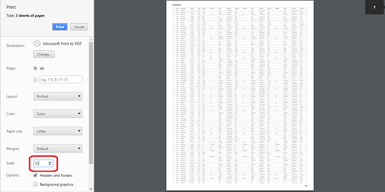

# Print in React TreeGrid

Print the TreeGrid by calling the [print](https://ej2.syncfusion.com/react/documentation/api/treegrid/#print) method from the TreeGrid instance. The print option can be shown on the [toolbar](https://ej2.syncfusion.com/react/documentation/api/treegrid/#toolbar) by adding the **Print** toolbar item.











## Page setup

Some print options cannot be configured through JavaScript. Customize layout, paper size, and margins using the browser’s page setup dialog. Refer to the following resources for details:

* [Chrome](https://support.google.com/chrome/answer/1069693?hl=en&visit_id=1-636335333734668335-3165046395&rd=1)
* [Firefox](https://support.mozilla.org/en-US/kb/how-print-web-pages-firefox)
* [Safari](http://www.mintprintables.com/print-tips/adjust-margins-osx/)
* [IE](http://www.helpteaching.com/help/print/index.htm)

## Print using an external button

To print the TreeGrid from an external button, invoke the [print](https://ej2.syncfusion.com/react/documentation/api/treegrid/#print) method.











## Print the visible page

By default, the TreeGrid prints all pages. To print only the current page, set [printMode](https://ej2.syncfusion.com/react/documentation/api/treegrid/#printmode) to **CurrentPage**.











## Print large number of columns

Browsers typically use A4 as the default page size for printing, and the print preview may hide overflowed content to fit the page. As a result, TreeGrids with many columns can be truncated in print output. 
 
To display more columns when printing, adjust the scale option in the browser’s print dialog according to the content width.

## Show or Hide columns while Printing

Show a hidden column or hide a visible column during printing using the [toolbarClick](https://ej2.syncfusion.com/react/documentation/api/treegrid/#toolbarclick) and [printComplete](https://ej2.syncfusion.com/react/documentation/api/treegrid/#printcomplete) events.  

In the [toolbarClick](https://ej2.syncfusion.com/react/documentation/api/treegrid/#toolbarclick) event, when **args.item.text** is **Print**, toggle visibility by setting the [column.visible](https://ej2.syncfusion.com/react/documentation/api/treegrid/column/#visible) property to **true** or **false**. 

In the `printComplete` event, restore the previous column visibility state.  

In the following example, the **Duration** column is initially hidden. During printing, **Duration** is shown and **StartDate** is hidden.











## Limitations of Printing Large Data

When the TreeGrid contains a large volume of data, printing all records at once can impact browser performance because rendering all DOM elements on a single page is expensive and may cause slowdowns or hangs.  

If printing all data is required, consider exporting the TreeGrid to **Excel**, **CSV**, or **PDF**, and then print using a desktop application.

> Refer to the [React TreeGrid](https://www.syncfusion.com/react-ui-components/react-tree-grid) feature tour page for highlights. Explore the [React TreeGrid example](https://ej2.syncfusion.com/react/demos/#/material/treegrid/treegrid-overview) to learn how to present and manipulate data.