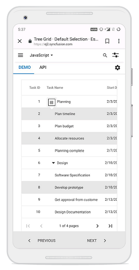

# Selection in React Treegrid component

Selection provides an option to highlight a row or cell. Selection can be done through simple Mouse down or Arrow keys.To disable selection in the TreeGrid, set the [`allowSelection`](https://ej2.syncfusion.com/react/documentation/api/treegrid/#allowselection) to **false**.

To get start quickly with Selection, you can check on this video:



The treegrid supports two types of selection that can be set by using the [`selectionSettings.type`](https://ej2.syncfusion.com/react/documentation/api/treegrid/selectionSettings/#type).They are:

* **Single** - It is set by default. Allows you to select only a single row or cell.
* **Multiple** - Allows you to select multiple rows or cells.
To perform the multi-selection, press and hold CTRL key and click the desired rows or cells.
To select range of rows or cells, press and hold the SHIFT key and click the rows or cells.










 

## Selection mode

TreeGrid supports three types of selection mode which can be set by using [`selectionSettings.mode`](https://ej2.syncfusion.com/react/documentation/api/treegrid/selectionSettings/#mode). They are:

* **Row** - It is set by default. Allows you to select rows only.
* **Cell** - Allows you to select cells only.
* **Both** - Allows you to select rows and cells at the same time.










 

## Touch interaction

When you tap a treegrid row on touchscreen device, the tapped row is selected. It also shows a popup   for multi-row selection. To select multiple rows or cells, tap the popup  and then tap the desired rows or cells.

> Multi-selection requires the selection [`type`](https://ej2.syncfusion.com/react/documentation/api/treegrid/selectionSettings/#type) to be **Multiple**.

The following screenshot represents a treegrid touch selection in the device.

<!-- markdownlint-disable MD033 -->

<!-- markdownlint-enable MD033 -->

> You can refer to our [`React Tree Grid`](https://www.syncfusion.com/react-components/react-tree-grid) feature tour page for its groundbreaking feature representations. You can also explore our [`React Tree Grid example`](https://ej2.syncfusion.com/react/demos/#/material/treegrid/treegrid-overview) to knows how to present and manipulate data.