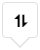
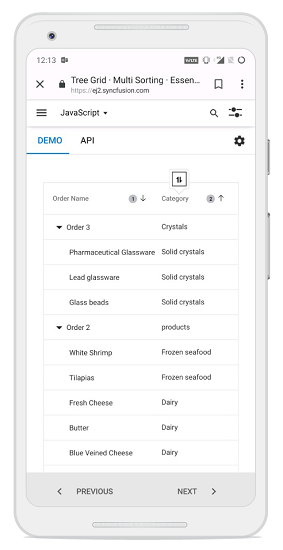

# Sorting in React Treegrid component

Sorting enables you to sort data in the *Ascending* or *Descending* order. To sort a column, click the column header.

To sort multiple columns, press and hold the CTRL key and click the column header.  You can clear sorting of any one of the multi-sorted columns by pressing and holding the SHIFT key and clicking the specific column header.

To enable sorting in the TreeGrid, set the [`allowSorting`](https://ej2.syncfusion.com/react/documentation/api/treegrid/#allowsorting) to true. Sorting options can be configured through the [`sortSettings`](https://ej2.syncfusion.com/react/documentation/api/treegrid/sortSettings).

To use Sorting, inject **Sort** module in TreeGrid.










 

> * TreeGrid columns are sorted in the **Ascending** order. If you click the already sorted column, the sort direction toggles.
> * You can apply and clear sorting by invoking [`sortByColumn`](https://ej2.syncfusion.com/react/documentation/api/treegrid#sortbycolumn) and [`clearSorting`](https://ej2.syncfusion.com/react/documentation/api/treegrid/#clearsorting) methods.
> * To disable sorting for a particular column, set the [`columns.allowSorting`](https://ej2.syncfusion.com/react/documentation/api/treegrid/#allowSorting) to *false*.

## Initial Sort

To sort at initial rendering, set the [`field`](https://ej2.syncfusion.com/react/documentation/api/treegrid/sortDescriptorModel/#field) and [`direction`](https://ej2.syncfusion.com/react/documentation/api/treegrid/sortDescriptorModel/#direction) in the [`sortSettings.columns`](https://ej2.syncfusion.com/react/documentation/api/treegrid/sortSettings/#columns).










 

## Sorting Events

During the sort action, the treegrid component triggers two events. The [`actionBegin`](https://ej2.syncfusion.com/react/documentation/api/treegrid/#actionbegin) event triggers before the sort action starts, and the [`actionComplete`](https://ej2.syncfusion.com/react/documentation/api/treegrid/#actioncomplete) event triggers after the sort action is completed. Using these events you can perform the needed actions.










 

> The `args.requestType` is the current action name. For example, in sorting the `args.requestType` value is *sorting*.

## Custom sort comparer

You can customize the default sort action for a column by defining the [`column.sortComparer`](https://ej2.syncfusion.com/react/documentation/api/treegrid/column/#sortcomparer) property. The sort comparer function has the same functionality like [`Array.sort`](https://developer.mozilla.org/en-US/docs/Web/JavaScript/Reference/Global_Objects/Array/sort) sort comparer.

In the following example, custom sort comparer function was defined in the *Category* column.










 

> The sort comparer function will work only for the local data.

## Touch Interaction

When you tap the treegrid header on touchscreen devices, the selected column header is sorted. A popup  is displayed for multi-column sorting. To sort multiple columns, tap the popup, and then tap the desired treegrid headers.

The following screenshot shows treegrid touch sorting.

<!-- markdownlint-disable MD033 -->

<!-- markdownlint-enable MD033 -->

> You can refer to our [`React Tree Grid`](https://www.syncfusion.com/react-ui-components/react-tree-grid) feature tour page for its groundbreaking feature representations. You can also explore our [`React Tree Grid example`](https://ej2.syncfusion.com/react/demos/#/material/treegrid/treegrid-overview) to knows how to present and manipulate data.
