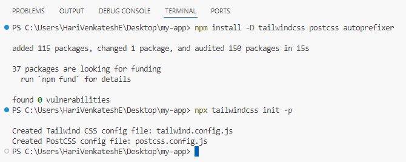
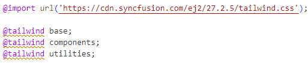

# Build your first React app with our blocks

This tutorial guides you through building a React application using Syncfusion's UI Kit blocks. It demonstrates how to set up a new React app with Next.js, choose between Tailwind CSS or Bootstrap 5.3 themes, and add a sign-in block in your application. The goal is to help developers quickly build responsive, modern web apps using a variety of pre built blocks with minimal effort.

To quickly get started with building your first React app, you can check out this video:



## Create a new React app
A **Next.js** app is used for this example. To create a new app, refer to the official setup guide [here](https://nextjs.org/docs/app/getting-started/installation). This tutorial then walks through the step-by-step process of adding a simple sign-in block to the newly created app, named **my-app**.

> * When prompted with the question **"Would you like to use Tailwind CSS?"** during **Next.js** app setup, select **No** to avoid automatically integrating **Tailwind CSS** into your app.
> * When prompted with the question **"Would you like your code inside a `src/` directory?"** during **Next.js** app setup, select **Yes** to maintain consistency with the following steps.


## Setting up Tailwind CSS or Bootstrap 5.3 theme in the app

After creating the new app named **my-app**, open it in Visual Studio Code (which will be used throughout this walkthrough). Once the app is open, navigate to the **src -> app -> page.tsx** file and remove only the template HTML code. Then, navigate to **src -> app -> globals.css** and **src -> app -> page.module.css** files, and remove all default CSS code.

The next step is to choose a theme, either **Tailwind CSS** or **Bootstrap 5.3**, in either light or dark mode, and configure **my-app** accordingly.

### Tailwind CSS configuration

If you choose **Tailwind CSS** theme, follow these steps to configure it.

1. In the Visual Studio Code terminal, run the following commands to install the **Tailwind CSS** packages and create the **tailwind.config.js** file.

    ```bash
    npm install -D tailwindcss@3 postcss autoprefixer
    npx tailwindcss init -p
    ```
  
    

2. In the **tailwind.config.js** file, add the following code to `content`, `darkMode`, and `theme` configurations. When creating the **Next.js** app, if the option **"Would you like your code inside a `src/` directory?"** was set to **Yes**, all the app-related files will be placed inside the **src** folder. Therefore, the `content` configuration should reflect this. If this option was not selected, the `content` configuration will need to be adjusted accordingly.

    ```js
    module.exports = {
      content: ["./src/**/*.{js,ts,jsx,tsx,mdx}"],
      darkMode: 'class',
      theme: {
        extend: {
          colors: {
            primary: {
              // NOTE: In this demo, different shades of "Indigo" are used as primary colors.
              "50": "#eef2ff",
              "100": "#e0e7ff",
              "200": "#c7d2fe",
              "300": "#a5b4fc",
              "400": "#818cf8",
              "500": "#6366f1",
              "600": "#4f46e5",
              "700": "#4338ca",
              "800": "#3730a3",
              "900": "#312e81",
              "950": "#1e1b4b"
            }
          }
        },
      },
      plugins: [],
    }
    ```
    > The Syncfusion React components uses **Indigo** for light mode and **Cyan** for dark mode. To maintain a uniform appearance, change the primary color accordingly.


3. In the **src -> app -> globals.css** file, add the following code. This will ensure that the **Tailwind CSS** styles are generated and consolidated for the entire application.

    ```css
    @tailwind base;
    @tailwind components;
    @tailwind utilities;
    ```

4. In the **src -> app -> layout.tsx** file, add the following code for light mode (`className="light"`) and dark mode (`className="dark"`) in the `<html>` tag.

    - For **light mode**:

    ```html
    <html lang="en" className="light">
    ```

    - For **dark mode**:

    ```html
    <html lang="en" className="dark">
    ```

5. In the **src -> app -> globals.css** file, add the style-oriented CDN link for Syncfusion React components using `@import` in the CSS. Ensure that the Syncfusion React components CSS is placed above the Tailwind CSS to avoid any potential style conflicts.

    - For **light mode**:

    ```css
    @import url('https://cdn.syncfusion.com/ej2/27.2.5/tailwind.css');
    ```

    - For **dark mode**:

    ```css
    @import url('https://cdn.syncfusion.com/ej2/27.2.5/tailwind-dark.css');
    ```

    
    
6. **OPTIONAL**: If you wish to use our font icons prepared for **Tailwind CSS**, you can include the following CDN link:

    ```css
    @import url('https://cdn.syncfusion.com/ej2/react/ui-kit/font-icons/tailwind-icons.css');
    ```
  
Now that the **Tailwind CSS** theme is configured for either light or dark mode of your choice, the app is ready for the next set of processes.

### Bootstrap 5.3 configuration

If you choose **Bootstrap 5.3** theme, follow these steps to configure it.

1. In the **src -> app -> layout.tsx** file, add the following code for light mode (`data-bs-theme="light"`) and dark mode (`data-bs-theme="dark"`) in the `<html>` tag.

    - For **light mode**:

    ```html
    <html lang="en" data-bs-theme="light">
    ```

    - For **dark mode**:

    ```html
    <html lang="en" data-bs-theme="dark">
    ```

2. In the **src -> app -> layout.tsx** file, add the style oriented CDN link for **Bootstrap 5.3** theme in the `<head>` tag.

     ```html
     <link href="https://cdn.jsdelivr.net/npm/bootstrap@5.3.3/dist/css/bootstrap.min.css" rel="stylesheet" />
     ```

3. In the **src -> app -> layout.tsx** file, add the style oriented CDN link for Syncfusion React components in the `<head>` tag.

    - For **light mode**:

    ```html
    <link href="https://cdn.syncfusion.com/ej2/27.2.5/bootstrap5.3.css" rel="stylesheet">
    ```

    - For **dark mode**:

    ```html
    <link href="https://cdn.syncfusion.com/ej2/27.2.5/bootstrap5.3-dark.css" rel="stylesheet" />
    ```

4. **OPTIONAL**: If you wish to use our font icons prepared for **Bootstrap 5.3**, you can include the following CDN link:

    ```html
    <link href="https://cdn.syncfusion.com/ej2/react/ui-kit/font-icons/bootstrap5.3-icons.css" rel="stylesheet" />
    ```

You can refer to the consolidated screenshot below for more details.


Now that the **Bootstrap 5.3** theme is configured for either light or dark mode of your choice, the app is ready for the next set of processes.

## Steps to explore and copy block code snippets

Now that **my-app** is set up with the desired theme configuration, the next step is to copy and paste the pre-built simple sign-in block code into the app for quick development. Here are a couple of ways to achieve this.

### Steps to explore and copy block code snippets from the online demo

1. In the [online demo](https://ej2.syncfusion.com/react/essential-ui-kit/blocks), navigate to the **Authentication** category and select the **Sign In** block. This will direct you to the appropriate demo page.

    

2. On the demo page, go to the first demo, which showcases a simple sign-in block. Choose the desired theme, then switch from the **Preview** tab to the **Code** tab.

    

3. In the **Code** tab, copy the TSX (HTML and TS) code using the **Copy to Clipboard** option and paste it into the **src -> app -> page.tsx** file. Once done, modify `export default function Signin1` to `export default function Home`. Additionally, it is mandatory to include the `'use client';` statement in the **src -> app -> page.tsx** file.

    

4. If CSS is provided, copy the CSS code and paste it into the **src -> app -> page.module.css** file; otherwise, ignore it.

### Steps to explore and copy block code snippets from the GitHub source

1. On [downloading](https://github.com/syncfusion/essential-ui-kit-for-react) and opening the GitHub source in Visual Studio Code, navigate to the following folder: **src -> app -> blocks-section**.

    

2. Inside, you'll find a list of folders, each corresponding to a specific block. Open the **signin** block folder, where you'll see the demo arranged sequentially.

3. Go to the first folder, **src/app/blocks-section/signin/signin-1**, where you'll find the TSX and CSS files of the simple sign-in block. You can copy the code directly from these files.

    

> **Note:**
> 
> 1. It is mandatory to include the `'use client';` statement in the TSX file.
> 2. In the TSX, the **Tailwind CSS** and **Bootstrap 5.3** design code is placed in their respective switch case statements. You can copy and paste as per your requirement.
> 3. Ignore the code within the **"SB Code - Start"** and **"SB Code - End"** comments, as it is intended solely for sample browser purposes.

## Steps to install and configure Syncfusion React components

While copying and pasting the TSX (HTML and TS) code, you'll notice that Syncfusion React components are used. To incorporate them into **my-app**, install the necessary packages and import the corresponding modules to the **src -> app -> page.tsx** file for the app to run.

In the simple sign-in block, components such as textbox, checkbox and button are used. After copying and pasting HTML and TS code into the TSX file, open the **package.json** file and add the required packages: `@syncfusion/ej2-react-buttons` and `@syncfusion/ej2-react-inputs`. For more details about other Syncfusion React component packages, refer to this [link](https://www.npmjs.com/search?q=%40syncfusion%2Fej2-react).


Once the necessary packages are added, run the `npm install` command via the terminal to install those packages in the **node_modules** folder.


Finally, again check the [online demo](https://ej2.syncfusion.com/react/essential-ui-kit/blocks) or the [GitHub repository](https://github.com/syncfusion/essential-ui-kit-for-react) and copy the required HTML, TS, and CSS code for the simple sign-in block into your app as outlined in the previous topic.

## Steps to download and add assets to the app

If you want to view and experience the images used in our design, you can download the **assets** folder from the following [GitHub repository](https://github.com/syncfusion/essential-ui-kit-for-react/tree/master/ui-blocks/public), place it inside the **public** folder of **my-app**, and modify the image URLs in the HTML if necessary.

## Steps to run the app

Now that everything is set up in **my-app** — including the TSX (HTML and TS), CSS (if applicable), and assets (optional) — you are ready to build and launch the app. Type the `npm run dev` command in the terminal, and you will see a localhost URL provided by the React development server.


To view the app in your browser, simply **Ctrl + Click** (or **Cmd + Click** on macOS) on the localhost URL displayed in the terminal. This will open the app in your default browser, allowing you to view and experience the simple sign-in block.


