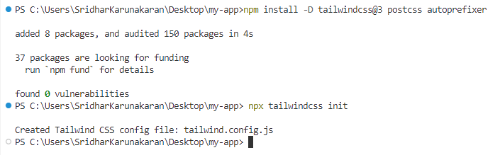

# Build your first React app with our blocks

This tutorial guides through building a React application using Syncfusion's UI Kit blocks. It demonstrates how to set up a new React app with Next.js, choose between Tailwind CSS or Bootstrap 5.3 themes, and add a sign-in block. The goal is to help developers quickly build responsive, modern web apps using prebuilt blocks with minimal effort.

To quickly get started, watch this video:



## Create a new React app

This example uses a **Next.js** app. To create a new app, follow the official Next.js setup guide: [Next.js Getting Started](https://nextjs.org/docs/app/getting-started/installation). This tutorial adds a simple sign-in block to a new app named **my-app**.

> When prompted during Next.js setup:
> * For "Would you like to use Tailwind CSS?" select **No** to avoid automatic Tailwind integration.
> * For "Would you like your code inside a `src/` directory?" select **Yes** to match the steps below.


## Setting up Tailwind CSS or Bootstrap 5.3 theme

Open **my-app** in Visual Studio Code. In **src/app/page.tsx** remove the template HTML. Also clear default CSS in **src/app/globals.css** and **src/app/page.module.css**.

Choose a theme (Tailwind CSS or Bootstrap 5.3) and configure **my-app** accordingly.

### Tailwind CSS configuration

1. Install Tailwind CSS and create the config:

```bash
npm install -D tailwindcss@3 postcss autoprefixer
npx tailwindcss init -p
```



2. Update **tailwind.config.js** (adjust `content` if you used `src/`):

```js
module.exports = {
  content: ["./src/**/*.{js,ts,jsx,tsx,mdx}"],
  darkMode: 'class',
  theme: {
    extend: {
      colors: {
        primary: {
          "50": "#eef2ff",
          "100": "#e0e7ff",
          "200": "#c7d2fe",
          "300": "#a5b4fc",
          "400": "#818cf8",
          "500": "#6366f1",
          "600": "#4f46e5",
          "700": "#4338ca",
          "800": "#3730a3",
          "900": "#312e81",
          "950": "#1e1b4b"
        }
      }
    },
  },
  plugins: [],
}
```

> Syncfusion React components use **Indigo** for light mode and **Cyan** for dark mode. Adjust the primary color to match your theme.

3. Add Tailwind directives in **src/app/globals.css**:

```css
@tailwind base;
@tailwind components;
@tailwind utilities;
```

4. Set the document `<html>` class in **src/app/layout.tsx**:

- Light mode:
```html
<html lang="en" className="light">
```
- Dark mode:
```html
<html lang="en" className="dark">
```

5. Import Syncfusion Tailwind theme CSS in **src/app/globals.css** (place above Tailwind imports to reduce conflicts):

- Light mode:
```css
@import url('https://cdn.syncfusion.com/ej2/27.2.5/tailwind.css');
```
- Dark mode:
```css
@import url('https://cdn.syncfusion.com/ej2/27.2.5/tailwind-dark.css');
```


6. (Optional) Include Syncfusion font icons for Tailwind:
```css
@import url('https://cdn.syncfusion.com/ej2/react/ui-kit/font-icons/tailwind-icons.css');
```

### Bootstrap 5.3 configuration

1. Set the theme attribute in **src/app/layout.tsx**:

- Light mode:
```html
<html lang="en" data-bs-theme="light">
```
- Dark mode:
```html
<html lang="en" data-bs-theme="dark">
```

2. Add Bootstrap CSS in the `<head>`:

```html
<link href="https://cdn.jsdelivr.net/npm/bootstrap@5.3.3/dist/css/bootstrap.min.css" rel="stylesheet" />
```

3. Add Syncfusion Bootstrap theme CSS in the `<head>`:

- Light mode:
```html
<link href="https://cdn.syncfusion.com/ej2/27.2.5/bootstrap5.3.css" rel="stylesheet" />
```
- Dark mode:
```html
<link href="https://cdn.syncfusion.com/ej2/27.2.5/bootstrap5.3-dark.css" rel="stylesheet" />
```

4. (Optional) Include Syncfusion font icons for Bootstrap:
```html
<link href="https://cdn.syncfusion.com/ej2/react/ui-kit/font-icons/bootstrap5.3-icons.css" rel="stylesheet" />
```


## Steps to explore and copy block code snippets

After configuring the theme, copy a prebuilt sign-in block into **my-app**.

### From the online demo

1. Open the online demo: [Essential UI Kit - Blocks](https://ej2.syncfusion.com/react/essential-ui-kit/blocks). Navigate to **Authentication** > **Sign In**.


2. On the demo page select the desired theme and switch from **Preview** to **Code**.


3. Copy the TSX code (use **Copy to Clipboard**) and paste into **src/app/page.tsx**. Change `export default function Signin1` to `export default function Home` and include `'use client';` at the top of the file.


4. If CSS is provided, paste it into **src/app/page.module.css**.

### From GitHub source

1. Clone or download the GitHub source: https://github.com/syncfusion/essential-ui-kit-for-react and open it in VS Code. Navigate to **src/app/blocks-section/signin/signin-1** to find TSX and CSS files to copy.


> Notes:
> * Include `'use client';` in the TSX file.
> * Tailwind and Bootstrap code is placed in switch cases—copy the appropriate block.
> * Ignore code within **"SB Code - Start"** and **"SB Code - End"** comments (sample browser utilities).

## Install and configure Syncfusion React components

Add required packages referenced by the block (e.g., `@syncfusion/ej2-react-buttons`, `@syncfusion/ej2-react-inputs`) to **package.json** and run:

```bash
npm install
```


## Add assets to the app

To include design images, download the **assets** folder from the GitHub repo: https://github.com/syncfusion/essential-ui-kit-for-react/tree/master/ui-blocks/public and place it in the **public** folder. Update image URLs as needed.

## Run the app

Start the development server:

```bash
npm run dev
```

Open the provided localhost URL in the browser to view the sign-in block.


