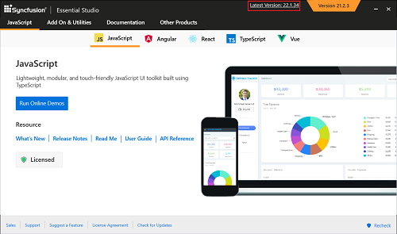

# Upgrading Syncfusion&reg; JavaScript (Essential&reg; JS2)

Syncfusion&reg; releases new volumes every three months, each introducing new features. Service Pack releases follow to address major bug fixes for the volume releases.

You can upgrade to the latest version from any installed Syncfusion&reg; version.

See the [Upgrade Guide](https://help.syncfusion.com/upgrade-guide/react-ui-components) for JavaScript - EJ2 to learn more about breaking changes, bug fixes, new features, and known issues between your current version and the target version.

## Upgrading to the latest version

The most recent version of Syncfusion&reg; JavaScript - EJ2 can be installed by downloading the latest installer from the Syncfusion account page or by using the Control Panel's "Latest Version" link.

You can also upgrade by downloading and installing the required products from the Downloads page: https://www.syncfusion.com/account/downloads. Existing installed versions do not need to be uninstalled before upgrading.

It is not required to install a volume release before installing its Service Pack. Volume and Service Pack releases are independent; you can install the latest Service Pack directly if it contains the fixes you need.

## Upgrade from trial version to licensed version

To move from a trial to a licensed installation, uninstall the trial version and install the fully licensed installer available on the [License & Downloads](https://www.syncfusion.com/account/downloads) page.

> Note: Starting with 2022 Volume 1 (v20.1.0.47), all Syncfusion&reg; customers—evaluators and paid customers—who use Syncfusion installers or npm packages must generate and register the corresponding platform- and version-specific license key in their projects.

For more information, see the [Licensing overview](https://ej2.syncfusion.com/react/documentation/licensing/overview/).