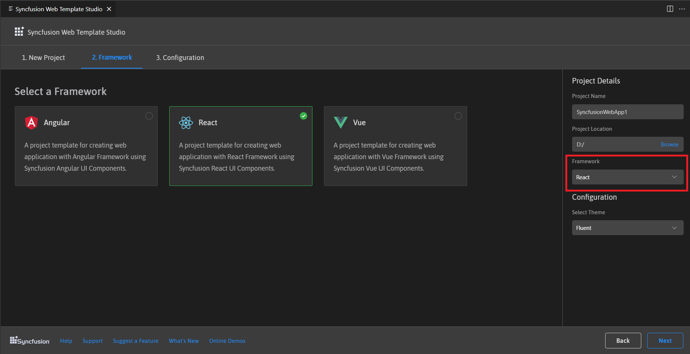

# Visual Studio Code Extensions

## Create project

Syncfusion&reg; provides project templates for Visual Studio Code to streamline the creation of Syncfusion&reg; React applications. These templates automatically configure the project with required Syncfusion NPM packages, component render code for Grid, Chart, and Scheduler components, and appropriate styling to accelerate development with Syncfusion components.

> The Syncfusion Visual Studio Code project template provides support for web project templates from v18.3.0.47.

Follow the steps below to create a Syncfusion Web Application using Visual Studio Code:

1. In Visual Studio Code, open the command palette by pressing **Ctrl+Shift+P**. In the palette, search for **Syncfusion** to view the available templates.

    

2. Select **Syncfusion Web Template Studio: Launch** and press Enter. The Template Studio wizard appears for configuring the Syncfusion Web app. Provide the required project name and path, then choose a framework (React, Pure React, Angular, or Vue).

    

3. Click **Next** or open the **Framework** tab to select a framework:

   * React
   * Pure React
   * Angular
   * Vue

    

    If you choose React, it will appear in the **Project Details** section and you can proceed to create the React application.

    

4. Click **Next** or open the **Configuration** tab to choose the preferred theme and other options, then click **Create**. The project will be created.

    

5. The created Syncfusion Web App is configured with Syncfusion NPM packages, styles, and component render code for the selected Syncfusion components.

    

    

    

## Run the application

1. Press **F5** or navigate to **Run > Start Debugging**.

    

2. After compilation completes, open the localhost URL shown in the terminal or browser to view the output.

    

## Add Syncfusion&reg; components to the application

The template showcases Chart, Grid, and Schedule components. To use other Syncfusion components, install the required component package and import it in your application. For npm package details, see [Installation with npm packages](https://ej2.syncfusion.com/react/documentation/installation/npm-package).

## Upgrading npm packages

When creating a new Syncfusion web app, the template installs the latest package versions. To update packages in an existing project without uninstalling, see [Update npm packages](https://ej2.syncfusion.com/react/documentation/upgrade/update-npm-package).