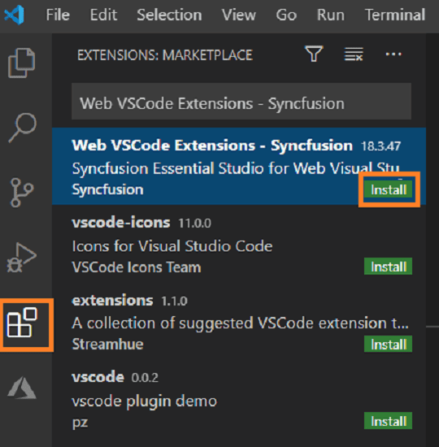

# Download and Installation Guide

Syncfusion&reg; publishes its Visual Studio Code extension in the [Visual Studio Code Marketplace](https://marketplace.visualstudio.com/items?itemName=SyncfusionInc.Web-VSCode-Extensions). Install the extension directly within Visual Studio Code or download it from the marketplace and then install it.

## Prerequisites

Before installing the Syncfusion&reg; Web extension, ensure the following software is installed:

* [Visual Studio Code](https://code.visualstudio.com/download)  
  > Minimum Visual Studio Code version required: **1.38.0**

* [C# Extension](https://marketplace.visualstudio.com/items?itemName=ms-vscode.csharp)

* [Node.js](https://nodejs.org/en/download/)

## Install through Visual Studio Code extensions

Follow these steps to install the Syncfusion&reg; Web extension from within Visual Studio Code:

1. Open Visual Studio Code.  
2. Go to **View > Extensions** to open the Extensions view.  
3. Type **Syncfusion Web** in the search box to locate the extension.

    

4. Click the **Install** button on the "Web VSCode Extensions - Syncfusion&reg;" extension.  
5. After installation, reload Visual Studio Code when prompted (use **Reload Required**).  
6. Access Syncfusion Web extension commands from the Visual Studio Code command palette.

    

## Install from the Visual Studio Code Marketplace

To install the extension from the Marketplace web page:

1. Open the Syncfusion Web Extension page on the Visual Studio Code Marketplace: https://marketplace.visualstudio.com/items?itemName=SyncfusionInc.Web-VSCode-Extensions  
2. Click **Install** (or **Install from Visual Studio Code Marketplace**). A browser prompt appears with **Open Visual Studio Code** — click **Open Visual Studio Code**. The extension page opens inside Visual Studio Code.  
3. Click the **Install** button for "Web VSCode Extensions - Syncfusion&reg;".  
4. After installation, reload Visual Studio Code when prompted.  
5. Use the Syncfusion Web extension commands from the command palette to create projects and access templates.

    