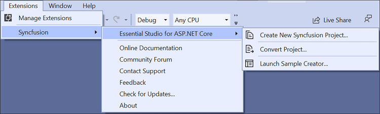
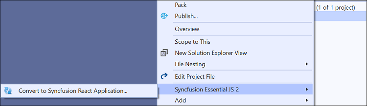
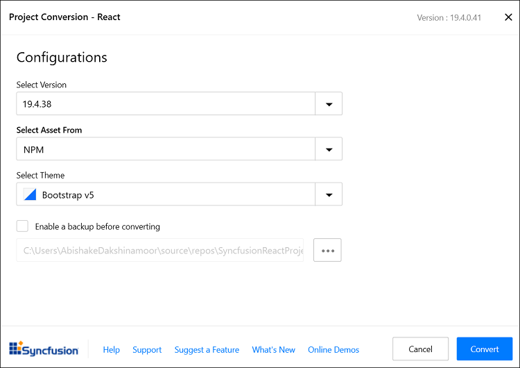
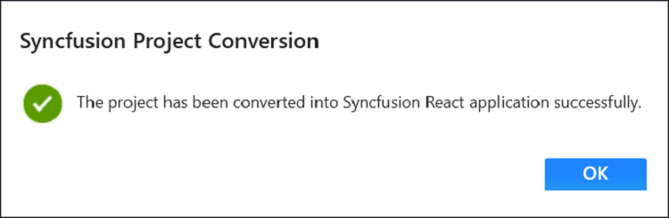

# Convert Project

Syncfusion&reg; React conversion is a Visual Studio add-in that converts an existing React application into a Syncfusion&reg; React web application.

> The Syncfusion&reg; React project conversion feature is available from v17.3.0.9.

Follow these steps to convert a React application to a Syncfusion React application using Visual Studio:

1. Open your existing React application or create a new React application.

2. To open the Syncfusion&reg; Project Conversion Wizard, use one of the options below:

    **Option 1:**  
    Choose **Extensions → Syncfusion → Essential Studio&reg; for ASP.NET Core → Convert Project…** from the Visual Studio menu.

    

    > In Visual Studio 2017, the **Syncfusion** menu may appear directly in the Visual Studio menu.

    **Option 2:**  
    Right-click the React project in Solution Explorer, select **Syncfusion Web**, then choose **Convert to Syncfusion React application...**.

    

3. The **Syncfusion React Project Conversion** window will appear. Choose the target Syncfusion React version, select the asset source, and pick the theme(s) to apply to the application.

    

    > Available Syncfusion React versions are loaded from published Syncfusion NPM packages and require an internet connection.

    Configuration options in the Project Conversion wizard:

    * **Assets From:** Load Syncfusion EJ2 assets into the React project from NPM, CDN, or Installed Location.  
      > The *Installed Location* option is available only when the Syncfusion EJ2 setup is installed locally.

    * **Choose the Theme:** Select the required theme(s).

4. (Optional) Check **Enable a backup before converting** and choose a backup location if you want the original project preserved.

5. After the conversion completes, a success message is displayed.

    

    If a backup was enabled, the original project is saved to the specified backup path.

    

6. The required Syncfusion React NPM packages (for the selected version), scripts, and styles are added to the application. Verify `package.json` and installed files to confirm the conversion is complete.