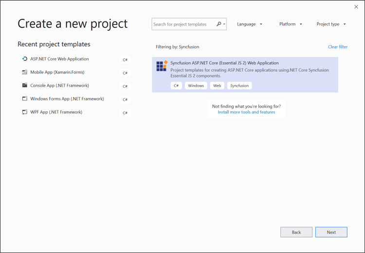
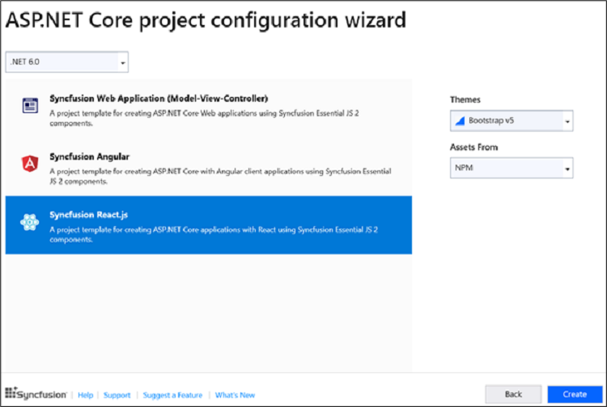

# Visual Studio Integration 

## Create project

Syncfusion&reg; provides the **Visual Studio Project Templates** for creating the Syncfusion&reg; React Application. The Syncfusion&reg; React application creates the application with the required Syncfusion&reg; references, namespaces and CDN links for making the development earlier with the Syncfusion&reg; components.

> The Syncfusion&reg; React project templates are available from v17.1.0.47.

The following steps help you to create the Syncfusion&reg; React Application through the Visual Studio:
1. Open the Visual Studio 2022.
2. To create a Syncfusion&reg; React project, follow either one of the options below:

    **Option 1:**

     Choose the **Extension->Syncfusion-> Essential Studio&reg; for ASP.NET Core -> Create New Syncfusion&reg; Project… in the Visual Studio menu.**

    

    > In Visual Studio 2017, you can see the **Syncfusion&reg;** menu directly in the Visual Studio menu.

    **Option 2:**

     Choose **File -> New -> Project**. Opens a new dialog to create a new project. By filtering the project type with Syncfusion&reg; or using the **Syncfusion&reg;** keyword in the search option, you can get the templates offered by Syncfusion&reg; for ASP.NET Core.

       

    > In Visual Studio 2017, choose **File > New > Project** and navigate to **Syncfusion&reg; > .NET Core > Syncfusion&reg; ASP.NET Core Web Application** in **Visual Studio**. 

3. Select the **Syncfusion&reg; ASP.NET Core Web Application** and choose the Next button.

    

4. Name the **Project**, choose the destination location and then click **Create** button. The **Syncfusion&reg; ASP.NET Core**  project configuration wizard appears.

    

    Choose the **Syncfusion&reg; React.js** template and choose required theme, authentication type and asset.

    > Syncfusion&reg; React project template available from .NET 6.0 and .NET 7.0

5. Click the Create button, the Syncfusion&reg; React application has been created.

6. The created Syncfusion&reg; React application configured with Syncfusion.

7. The required Syncfusion&reg; React NPM packages, scripts and selected style configured with the application.