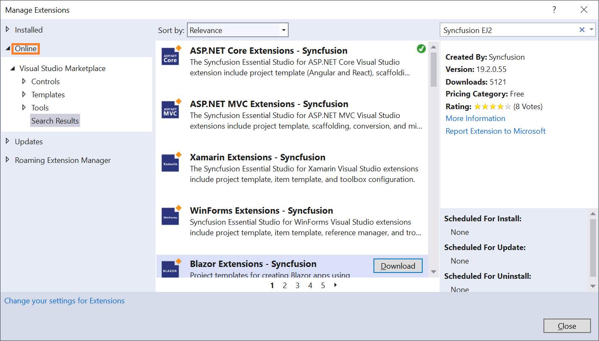
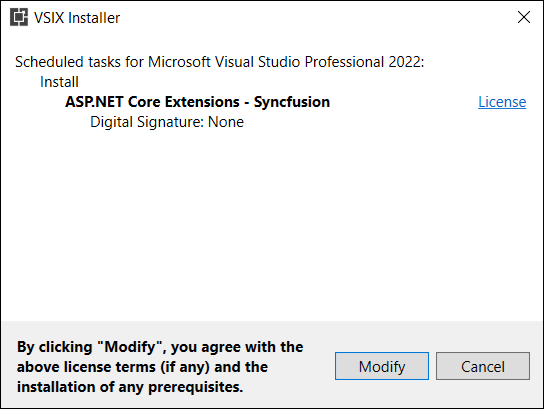
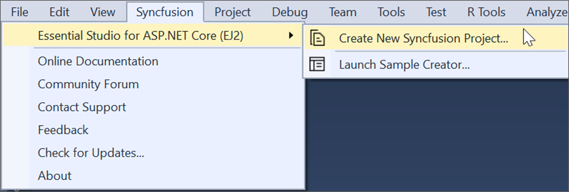
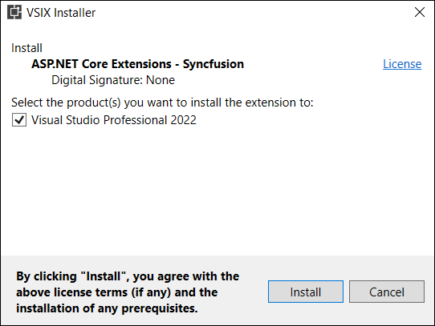

# Download and Installation

Syncfusion&reg; publishes the Visual Studio extension on the Visual Studio Marketplace. Install it directly from Visual Studio or download and install the VSIX from the marketplace.

- Visual Studio 2022: https://marketplace.visualstudio.com/items?itemName=SyncfusionInc.ASPNETCoreVSExtensions  
- Visual Studio 2019 or earlier: https://marketplace.visualstudio.com/items?itemName=SyncfusionInc.ASPNETCoreExtensions

## Prerequisites

Ensure the following software is installed before installing the Syncfusion&reg; ASP.NET Core extension for creating, adding snippets, converting, and upgrading Syncfusion applications:

* [Visual Studio 2022](https://visualstudio.microsoft.com/downloads)
* [.NET 6.0 or later](https://dotnet.microsoft.com/en-us/download/dotnet)

## Install through Visual Studio Manage Extensions

Follow these steps to install the Syncfusion&reg; ASP.NET Core extension from Visual Studio's Manage Extensions:

1. Open Visual Studio.  
2. Navigate to **Extensions → Manage Extensions**.  
   > In Visual Studio 2017, go to **Tools → Extensions and Updates**.
3. Click the **Online** tab and search for **Syncfusion EJ2**.

    

4. Click **Download** on the **ASP.NET Core Extension - Syncfusion** entry.  
5. Close all Visual Studio instances to begin the VSIX installation. A VSIX installation prompt appears.

    

6. Click **Modify** to install the extension.  
7. After installation completes, reopen Visual Studio.  
8. Use Syncfusion extension commands from the **Extensions** menu.

    

## Install from the Visual Studio Marketplace

To install the extension from the Marketplace site:

1. Open the extension page for your Visual Studio version and click **Install**:
   - Visual Studio 2022: https://marketplace.visualstudio.com/items?itemName=SyncfusionInc.ASPNETCoreVSExtensions  
   - Visual Studio 2019 or earlier: https://marketplace.visualstudio.com/items?itemName=SyncfusionInc.ASPNETCoreExtensions
2. Close all running instances of Visual Studio.  
3. If downloading the VSIX, double-click the file to start installation. Select the Visual Studio instances to install into when prompted.

    

4. Click **Modify** to proceed.  
5. After installation finishes, open Visual Studio and use Syncfusion commands from the **Extensions** menu.

    