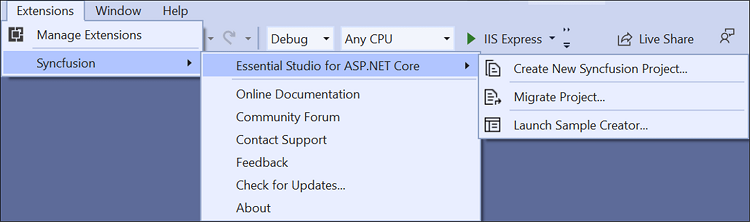
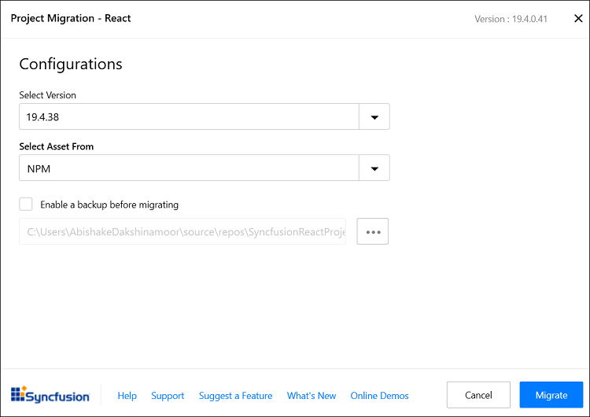
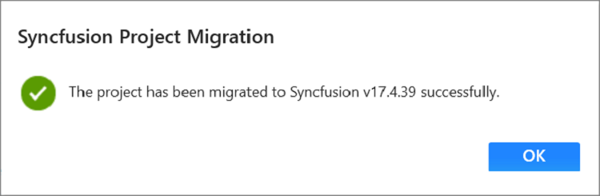
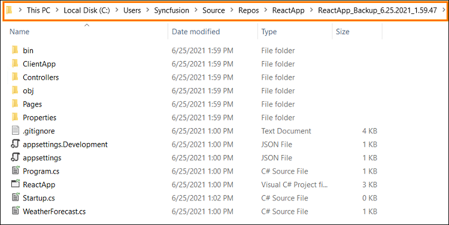

# Upgrade Project

The Syncfusion&reg; React migration add-in for Visual Studio allows migration of an existing Syncfusion&reg; React application from one Essential Studio&reg; version to another. This tool significantly reduces the manual effort involved in upgrading an application.

> The Syncfusion&reg; React project migration feature is available from v17.3.0.9.

Follow the steps below to upgrade the Syncfusion&reg; version in a Syncfusion&reg; React application using Visual Studio:

1. Open the Syncfusion&reg; React application that uses Syncfusion components.

2. To open the Migration Wizard, use one of the options below:

    **Option 1:**  
    Choose **Extensions → Syncfusion → Essential Studio for ASP.NET Core → Migrate Project…** from the Visual Studio menu.

    

    > In Visual Studio 2017, the **Syncfusion** menu may appear directly in the Visual Studio menu.

    **Option 2:**  
    Right-click the project in **Solution Explorer**, select **Syncfusion Web**, then choose **Migrate the Syncfusion ASP.NET Core Project to Another version…**.

    

3. The Syncfusion&reg; Project Migration window appears. Choose the target Syncfusion React version to migrate to.

    > Available Syncfusion React versions are loaded from published Syncfusion NPM packages and require an internet connection.

    

    **Assets From:** Load Syncfusion EJ2 assets into the React project from NPM, CDN, or Installed Location.

    > The *Installed Location* option is available only when the Syncfusion EJ2 setup is installed locally.

4. (Optional) Check **Enable a backup before migrating** and choose the backup location if you want to preserve the original project.

5. After the migration completes, a success message is displayed.

    

    If a backup was enabled, the original project is saved to the specified backup path.

    

6. The Syncfusion&reg; React NPM packages and CSS are updated to the selected version in the project. Verify `package.json` and project files to confirm the migration is complete.